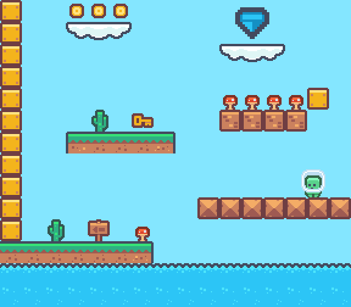

# Pixel art game: WebGL rendering test with PixiJS

This non-interactive test renders tilemap art and animations while  **locking the render to whole pixels**.   
The result avoids some common pixel art rendering artifacts like shimmering, tearing and blurring.

[View demo](https://loksland.github.io/pixel-art-game-test/)



### Summary
The PixiJS WebGL canvas is rendered at pixel dimensions then scaled up in whole values to be contained within the window viewport. The internal pixel dimensions of the scene remain constant.

The WebGL canvas element `imageRendering` property is set to `pixelated` which will scale using a nearest neighbor algorithm. This will prevent any bluring of the pixels as the whole canvas is scaled.
```js
app.view.style.imageRendering = 'pixelated';
```

The PixiJS base texture scale mode is set to nearest neighbour, which will prevent any blurring when scaling individual sprites.
```js
PIXI.BaseTexture.defaultOptions.scaleMode = PIXI.SCALE_MODES.NEAREST;
```

Enabling `ROUND_PIXELS` will floor position values when PixiJS performs rendering, so display objects always are rendered on whole pixels. 
```js
PIXI.settings.ROUND_PIXELS = true;
```

The internal `PIXEL_SCALE` property will render more pixels than needed so that when the PixiJS renderer rounds display object positions they animate more smoothly. A value of 2 will render each pixel as 2x2.  
The down side to a value over 1 is that it limits the available responsive sizes of the canvas.
```js
const PIXEL_SCALE = 1;
```

### Running locally

```bash
cd path/to/pxl/
npm run dev
```

### Libraries

**PixiJS**  
https://www.npmjs.com/package/pixi.js  
2D WebGL rendering library.

**GSAP**  
https://www.npmjs.com/package/gsap  
Used for demo animations.

**Choppy**    
https://www.npmjs.com/package/choppy  
Optional dev dependency used to export tile art from Photoshop and triggers the Texture Packer CLI to re-publish any associated spritesheets.

### Software

**Texture Packer**    
https://www.codeandweb.com/texturepacker  
Gathers individal tile art into a single spritesheet.

**Tiled tilemap editor**  
https://www.mapeditor.org/  
Used to create the level tilemap.

**Adobe Photoshop**  
Used to manage the art. Setup notes:
- Set up a grid under Preferences > Guides, Grids and Slices.
- Ensure snap to grid is disabled under View > Snap.
- Use the pencil tool with:
  - Auto erase disabled.
  - 100% hardness.
  - Brush spacing set to 1%.

### Attributions

`Pixel Platformer` tileset art provided by Kenney game assets:   
https://kenney.nl/assets/pixel-platformer

